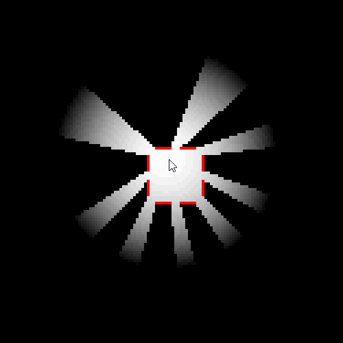
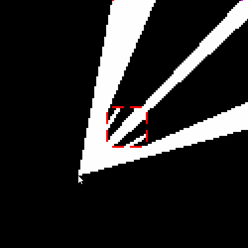
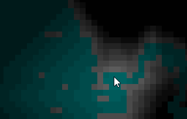

# HxLightMask
A collection of tiny-ish 2D lighting engine tools for Haxe (for grid-based games and whatnot). They have no external dependencies other than Haxe and the Haxe standard library, and are framework agnostic. The included demos use OpenFL for rendering & input, but you can use whatever you want in your own projects.


Above: the combined result of a `FancyLightMask` paired with a `ShadowMask`

# FancyLightMask

This is a simple ray-casting light mask that lets you put some lights in a scene that will respond properly to walls. All lights are spherical by default,
and their only properties (beside location) is intensity and decay (aka "falloff").



# ShadowMask

This is also a simple ray-casting light mask, but this lets you decide what's NOT visible. 



You can place `Visor`s in the scene that represent visible areas, and you can build a mask of everything that is not visible from any of your specified visors. 
The preview gif at the very top of this page is an example of using a `ShadowMask` and `FancyLightMask` together to create a flashlight effect -- a `Visor` and 
a `Light` are placed in the same location and move together, and the shadow mask is used to occlude everything but the desired light cone. For convenience and efficiency,
you can accomplish this simply by attaching a `Visor` directly to a `Light` and feeding it into `FancyLightMask`.

# FastLightMask

A *very* simple light mask, this doesn't use ray casting and doesn't produce spherical lights. On the plus side, it should be very fast and I don't think the computational cost
grows with the number of lights (unlike the above solutions). Perfectly useful for simpler purposes, or in scenes with cramped quarters.

Originally ported from [nick-paul/LightMask](https://github.com/nick-paul/LightMask). All credit for this idea and basic algorithm goes to [nick-paul](https://github.com/nick-paul). Also the documentation is based on nick's.



# Running the demos
The demos require OpenFL 8 to run (older versions will probably work too). 

Install libraries:
```
haxelib install openfl
haxelib dev hxlightmask path/to/HxLightMask
```

Build & run demo:
```
cd path/to/HxLightMask
cd demo
lime test html5
```

Press spacebar to advance between demos.

The demos will run on any platform OpenFL supports, including win/mac/linux destkop, HTML5, Flash, etc.

# How to use the tools

## FancyLightMask

### Initialize FancyLightMask and variables
```Haxe
	// The lightmask itself
	var lightmask:FancyLightMask = new FancyLightMask(WIDTH, HEIGHT);
	
	// Array representing walls (1: solid, 0:clear)
	// Stored in a single dimensional array
	// To set a wall value at (x,y) use walls[x * WIDTH * y] =
	var walls:Array<Int> = [for (i in 0...WIDTH * HEIGHT) {0;}];
```

### Adding lights and computing the mask

```Haxe
	// Create a light
	var light:Light = new Light(64, 64, 1.0, 0.025); //x, y, intensity, decay
	
	// Alternatively:
	// var visor:Visor = new Visor(64, 64, 1.0, 0.0, Math.PI/6); //x, y, direction vector (x), direction vector (y), field of view angle (in radians)
	// var light:Light = new Light(64, 64, 1.0, 0.025, visor);   //create a light with a visor attached, the visor will be used to mask it during light calculation
	
	//Add the light (unlike FastLightMask, no need to re-add it after reset())
	lightmask.add(light);
	
	// Reset the light mask
	// Must be called every frame
	lightmask.reset();
	
	// Compute the mask
    // Pass the `walls` array to the compute function
    lightmask.computeMask(walls);
```

## ShadowMask

### Initialize ShadowMask and variables
```Haxe
	// The shadowmask itself
	var shadowmask:ShadowMask = new ShadowMask(WIDTH, HEIGHT);
	
	// Array representing walls (1: solid, 0:clear)
	// Stored in a single dimensional array
	// To set a wall value at (x,y) use walls[x * WIDTH * y] =
	var walls:Array<Int> = [for (i in 0...WIDTH * HEIGHT) {0;}];
```

### Adding visors and computing the mask

```Haxe
	// Create a visor
	var visor:Visor = visor = new Visor(64, 64, 1.0, 1.0); //x, y, lookVectorX, lookVectorY
	
	//Add the visor
	shadowmask.add(visor);
	
	// Reset the shadow mask
	// Must be called every frame
	shadowmask.reset();
	
	// Compute the mask
	// Pass the `walls` array to the compute function
	shadowmask.computeMask(walls);
```


## FastLightMask

### Initialize FastLightMask and variables
```Haxe
    // The lightmask itself
    var lightmask:FastLightMask = new FastLightMask(WIDTH, HEIGHT);
    // Intensity: Proportional to how far light spreads
    lightmask.setIntensity(40.0);
    // Ambient: Ambient light (0.0 - 1.0)
    lightmask.setAmbient(0.4);

    // Array representing wall opacities (1.0: solid, 0.0: clear)
    // Stored in a single dimensional array
    // To set a wall value at (x,y) use walls[x + WIDTH * y] = ...
    var walls:Array<Float> = [for (i in 0...WIDTH * HEIGHT) {0.0;}];
```

### Adding lights and computing the mask

```Haxe
    // Reset the light mask
    // Must be called every frame
    lightmask.reset();

    // All lights must be added between `reset()` and `computeMask()`
    // Add a light with given brightness at location (x,y)
    // brightness: 0.0 = no light, 1.0 = full light
    lightmask.addLight(x, y, brightness);

    // Compute the mask
    // Pass the `walls` array to the compute function
    lightmask.computeMask(walls);
```

### Limitations

  - This was originally developed for a roguelike engine so framerate and performance were not a huge concern. If you have any performance improving ideas, submit an issue or a PR and I'd be happy to take a look.
  - Currently, the blur function creates a black border of unlit tiles on the outer edges of the map. To avoid this, don't use the blur function or make the lightmask slightly larger than the renderer size.

## Rendering the output of any of these

Assume we are using the following to represent a `Color` object where each channel is a value from `0.0` to `1.0`

```Haxe
    typedef Color {
        var r:Float;
        var g:Float;
        var b:Float;
    }
```

*(In actual practice you would want to use a more efficient data structure, such as an abstract over an `Int`, this is just for example)*

To compute the color of a tile at location `(x,y)` for rendering, multiply the color channels by the light mask at that location

```Haxe
    // Assume the call `map.getTileColor(x,y)`
    // gets the color of the map tile at location (x,y)
    var color:Color = map.getTileColor(x,y);

    // Multiply each of the channels by the light mask
    // 0.0: dark, 1.0: bright
    var tile_brightness:Float = lightmask.mask[x + y * width];
    var lighting_color:Color = {
        r:color.r * tile_brightness,
        g:color.g * tile_brightness,
        b:color.b * tile_brightness
    );

    // Render the tile with the new color
    // Assume `render()` takes an object to render and a color to render it
    // render(object, color)
    render(map.getTile(x, y), lighting_color);
```


